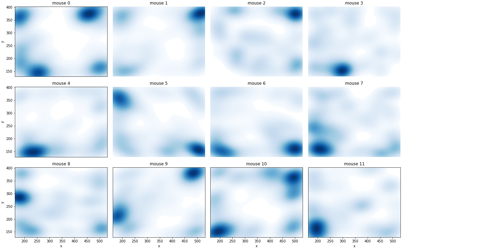
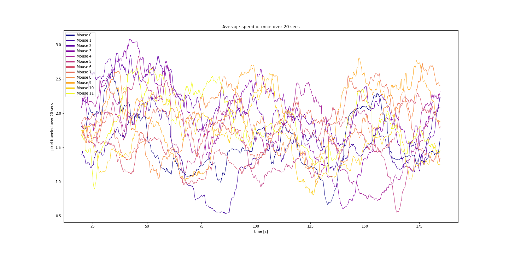
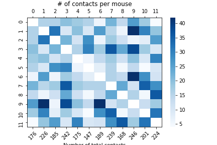

# UMA-Tracker-Analysis
Jupyter Notebook file for the analysis of the results of UMA-Tracker.
The examples show the results of a 3 minute video of 12 mice in a cage.

Example graphs

The area which the mice find themselves in

The average speed of the mice in a certain window

The number of contacts to other mice per mice

